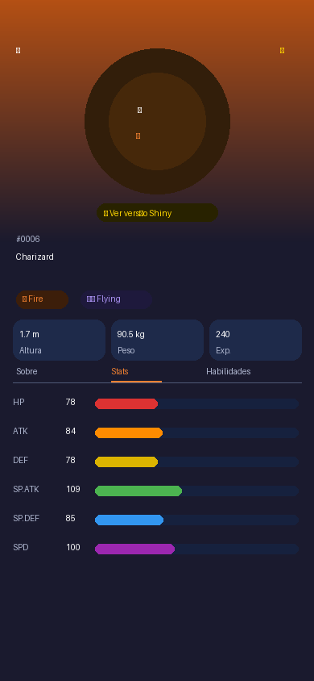
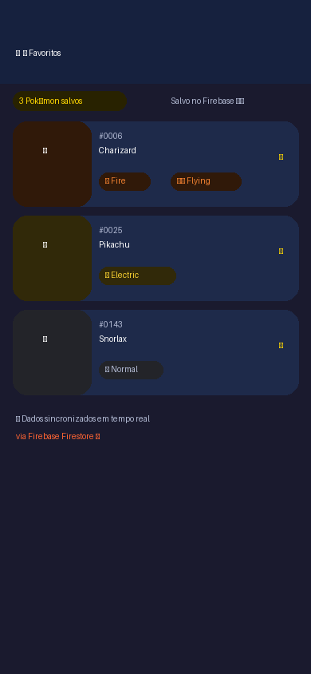
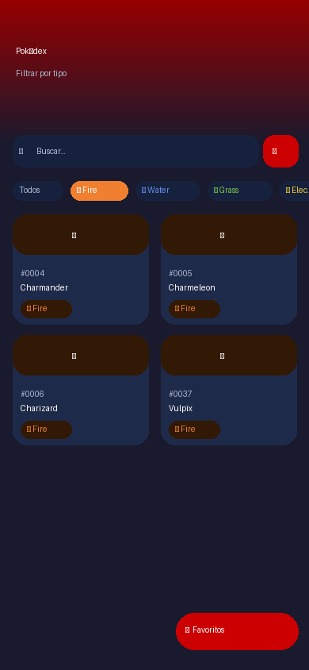

<div align="center">

# 🔴 Pokédex Flutter

> Aplicativo Flutter completo que consome a PokéAPI e integra com Firebase para persistência de favoritos em tempo real.

[](https://flutter.dev)
[](https://dart.dev)
[](https://firebase.google.com)
[](https://pokeapi.co)
[](LICENSE)

</div>

---

## 📱 Prints da Aplicação

<div align="center">
<table>
  <tr>
    <td align="center"><b>Home / Lista</b></td>
    <td align="center"><b>Detalhe do Pokémon</b></td>
    <td align="center"><b>Favoritos (Firebase)</b></td>
    <td align="center"><b>Filtro por Tipo</b></td>
  </tr>
  <tr>
    <td>
" width="180"/></td>
    <td></td>
    <td></td>
    <td></td>
  </tr>
</table>
</div>

---

## 📐 Arquitetura da Aplicação

```
┌─────────────────────────────────────────────────────────┐
│                    POKÉDEX FLUTTER                       │
│                                                         │
│  ┌──────────────────────────────────────────────────┐  │
│  │                  PRESENTATION LAYER               │  │
│  │  ┌────────────┐  ┌────────────┐  ┌────────────┐  │  │
│  │  │ HomeScreen │  │DetailScreen│  │ Favorites  │  │  │
│  │  │  - Grid    │  │  - Stats   │  │  Screen    │  │  │
│  │  │  - Search  │  │  - Shiny   │  │  - Stream  │  │  │
│  │  │  - Filter  │  │  - Types   │  │  - CRUD    │  │  │
│  │  └─────┬──────┘  └─────┬──────┘  └─────┬──────┘  │  │
│  └────────┼───────────────┼───────────────┼──────────┘  │
│           │               │               │              │
│  ┌────────▼───────────────▼───────────────▼──────────┐  │
│  │              STATE MANAGEMENT LAYER                │  │
│  │                  PokemonProvider                   │  │
│  │         (ChangeNotifier + Provider package)        │  │
│  │  - pokemonList  - selectedPokemon  - favoriteIds   │  │
│  │  - searchQuery  - selectedType     - loadingState  │  │
│  └────────┬─────────────────────────┬─────────────────┘  │
│           │                         │                     │
│  ┌────────▼──────────┐   ┌──────────▼──────────────┐    │
│  │   SERVICE LAYER   │   │      SERVICE LAYER       │    │
│  │  PokeApiService   │   │    FirebaseService        │    │
│  │  ───────────────  │   │  ─────────────────────── │    │
│  │  fetchPokemonList │   │  favoritesStream()         │    │
│  │  fetchPokemon     │   │  toggleFavorite()          │    │
│  │  Detail()         │   │  saveRecentlyViewed()      │    │
│  │  searchPokemon()  │   │  logPokemonViewed()        │    │
│  │  fetchTypes()     │   │  (Firebase Analytics)      │    │
│  └────────┬──────────┘   └──────────┬─────────────────┘  │
│           │                         │                      │
│  ┌────────▼──────────┐   ┌──────────▼──────────────┐    │
│  │   EXTERNAL APIs   │   │   FIREBASE SERVICES      │    │
│  │  PokeAPI v2       │   │  Cloud Firestore          │    │
│  │  pokeapi.co/v2    │   │  Firebase Analytics       │    │
│  └───────────────────┘   └──────────────────────────┘    │
└─────────────────────────────────────────────────────────-─┘
```

### Fluxo de Dados

```
User Input → Widget → Provider → Service → API/Firebase
                    ↑                    ↓
              notifyListeners()      dados retornam
                    ↑                    ↓
              Widget rebuild  ←  setState / Stream
```

---

## 🚀 Funcionalidades

| Feature | Descrição | Pontuação |
|---------|-----------|-----------|
| 📋 **Lista paginada** | Grid com 1025+ Pokémon, carregamento infinito | API |
| 🔍 **Busca** | Busca por nome ou número (#001) | API |
| 🎨 **Filtro por tipo** | 18 tipos: Fire, Water, Grass... | API |
| 📄 **Detalhe completo** | Stats, habilidades, descrição, altura, peso | API |
| ✨ **Versão Shiny** | Toggle para ver sprite shiny de cada Pokémon | API |
| ⭐ **Favoritos** | Salvar/remover favoritos persistidos no Firebase | Firebase |
| 🔄 **Sync em tempo real** | StreamBuilder com Firestore (atualização automática) | Firebase |
| 📊 **Analytics** | Eventos de navegação e interação via Firebase Analytics | Firebase |
| 🕒 **Vistos recentemente** | Histórico salvo no Firestore | Firebase |
| 🌙 **Dark Theme** | UI escura com cores por tipo de Pokémon | UI |
| 🎭 **Animações** | Hero transitions, stat bars animadas, shimmer loading | UI |

---

## 🛠️ Tecnologias Utilizadas

### Core
- **Flutter 3.x** — Framework cross-platform
- **Dart 3.x** — Linguagem de programação
- **Provider 6.x** — Gerenciamento de estado (ChangeNotifier)

### APIs & Backend
- **[PokéAPI v2](https://pokeapi.co/)** — REST API gratuita com dados de todos os Pokémon
- **Firebase Cloud Firestore** — Banco de dados NoSQL em tempo real (favoritos)
- **Firebase Analytics** — Rastreamento de eventos do usuário

### Pacotes Flutter
| Pacote | Uso |
|--------|-----|
| `http` | Requisições HTTP para a PokéAPI |
| `firebase_core` | Inicialização do Firebase |
| `cloud_firestore` | Banco de dados de favoritos |
| `firebase_analytics` | Analytics de uso |
| `provider` | Gerenciamento de estado |
| `cached_network_image` | Cache de imagens dos Pokémon |
| `shimmer` | Loading skeleton animation |
| `flutter_staggered_animations` | Animações na grid |
| `google_fonts` | Tipografia (Nunito) |
| `palette_generator` | Cores dinâmicas por Pokémon |

---

## 📦 Como Instalar e Executar

### Pré-requisitos

- Flutter SDK `>=3.0.0` instalado ([guia oficial](https://docs.flutter.dev/get-started/install))
- Dart SDK `>=3.0.0` (incluído com Flutter)
- Android Studio / VS Code com extensão Flutter
- Conta no [Firebase Console](https://console.firebase.google.com)
- Git

### 1. Clonar o repositório

```bash
git clone https://github.com/SEU_USUARIO/pokedex_flutter.git
cd pokedex_flutter
```

### 2. Instalar dependências

```bash
flutter pub get
```

### 3. Configurar Firebase

#### a) Criar projeto no Firebase Console
1. Acesse [console.firebase.google.com](https://console.firebase.google.com)
2. Crie um novo projeto (ex: `pokedex-flutter-app`)
3. Ative o **Cloud Firestore** (modo teste por 30 dias)
4. Ative o **Firebase Analytics**

#### b) Instalar FlutterFire CLI

```bash
dart pub global activate flutterfire_cli
```

#### c) Configurar automaticamente

```bash
flutterfire configure
```

> Isso gera o arquivo `lib/firebase_options.dart` automaticamente com suas credenciais.

#### d) Regras do Firestore

No Firebase Console → Firestore → Regras, use:

```javascript
rules_version = '2';
service cloud.firestore {
  match /databases/{database}/documents {
    match /{document=**} {
      allow read, write: if true; // Para desenvolvimento
    }
  }
}
```

### 4. Executar o app

```bash
# Verificar dispositivos disponíveis
flutter devices

# Executar no Android
flutter run

# Executar na Web
flutter run -d chrome

# Executar com release
flutter run --release
```

### 5. Gerar APK

```bash
# APK de debug
flutter build apk

# APK de release (otimizado)
flutter build apk --release

# APK split por ABI (menor tamanho)
flutter build apk --split-per-abi
```

O APK gerado estará em: `build/app/outputs/flutter-apk/app-release.apk`

### 6. Build para Web

```bash
flutter build web
```

---

## 📂 Estrutura do Projeto

```
pokedex_flutter/
├── lib/
│   ├── main.dart                   # Entry point, Firebase init, Provider setup
│   ├── firebase_options.dart       # Credenciais Firebase (gerado pelo flutterfire)
│   │
│   ├── models/
│   │   └── pokemon.dart            # Modelos de dados (Pokemon, PokemonStat, etc.)
│   │
│   ├── services/
│   │   ├── poke_api_service.dart   # Todas as chamadas à PokéAPI v2
│   │   └── firebase_service.dart   # Firestore CRUD + Analytics
│   │
│   ├── providers/
│   │   └── pokemon_provider.dart   # Estado global (ChangeNotifier)
│   │
│   ├── screens/
│   │   ├── home_screen.dart        # Lista paginada + busca + filtros
│   │   ├── detail_screen.dart      # Detalhes, stats, habilidades, shiny
│   │   └── favorites_screen.dart   # Favoritos em tempo real do Firestore
│   │
│   ├── widgets/
│   │   ├── pokemon_card.dart       # Card do Pokémon na grid
│   │   ├── type_chip.dart          # Chip colorido por tipo
│   │   └── stat_bar.dart           # Barra animada de estatística
│   │
│   └── theme/
│       └── app_theme.dart          # Tema dark + cores por tipo
│
├── screenshots/                    # Prints da aplicação
├── assets/images/                  # Assets locais
├── pubspec.yaml                    # Dependências
└── README.md
```

---

## 🌐 APK / Versão Web

> **Versão de demonstração:** [🔗 Acessar app web](#)  
> **Download APK:** [⬇️ app-release.apk](#)

> Para testar localmente, siga os passos de instalação acima e execute `flutter run -d chrome` para a versão web.

---

## 🗺️ Endpoints da PokéAPI utilizados

| Endpoint | Uso |
|----------|-----|
| `GET /pokemon?limit=20&offset=0` | Lista paginada |
| `GET /pokemon/{id}` | Detalhes do Pokémon |
| `GET /pokemon-species/{id}` | Descrição em texto |
| `GET /type` | Lista de tipos |
| `GET /type/{name}` | Pokémon por tipo |

---

## 🔥 Estrutura do Firebase (Firestore)

```
firestore/
├── favorites/
│   └── user_default/
│       └── pokemon/
│           ├── 6  (Charizard)
│           ├── 25 (Pikachu)
│           └── ...
└── recently_viewed/
    └── user_default/
        └── pokemon/
            ├── 143 (Snorlax)
            └── ...
```

---

## 👨‍💻 Autor

Desenvolvido para a disciplina de **Desenvolvimento Mobile** — UNIFACEF  
**Kaique** | Franca, SP

---

## 📄 Licença

Este projeto está sob a licença MIT. Veja [LICENSE](LICENSE) para mais detalhes.

> Pokémon e todos os nomes relacionados são marcas registradas da Nintendo/Game Freak.  
> Dados fornecidos pela [PokéAPI](https://pokeapi.co/) (gratuita e open-source).
